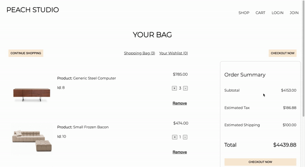

# Peach Studio
Peach Studio is an e-commerce website for you to find stylish furiniture, making your home .... sweet home.

## Preview

## Tech Stack
- 
- 
- 
- 
- 
- 
- 

## Deployed Link
http://peach-studio.herokuapp.com/

## Developers
- [David Li](https://github.com/davdli)
- [Hector Nevarez](https://github.com/hector-nevarez)
- [Kelsey Smith](https://github.com/paigekelsey)
- [Sala Yoshida](https://github.com/yoshidasala)
